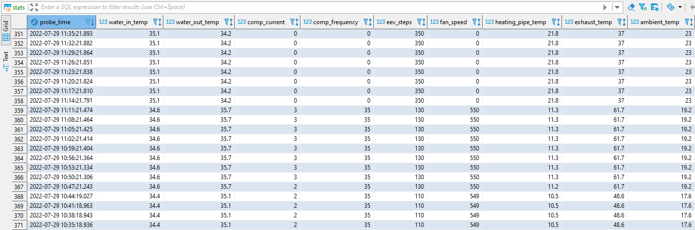
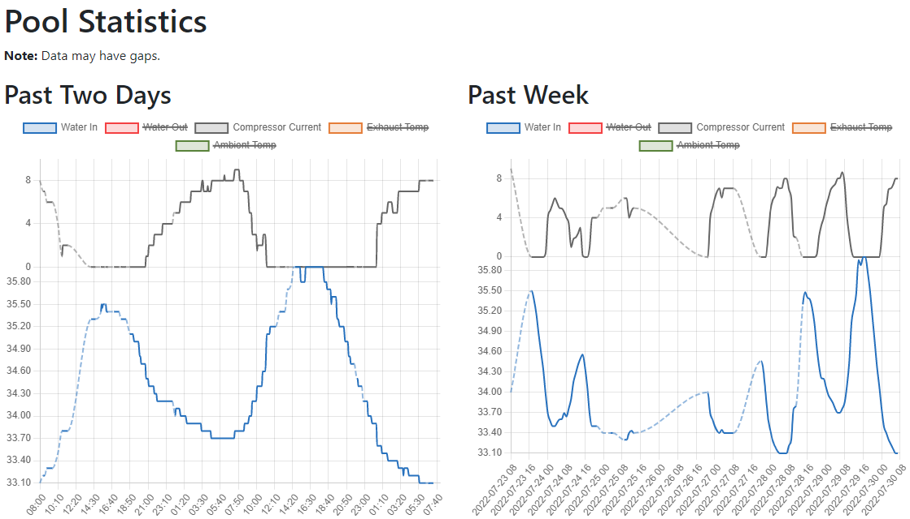

# zealux-monitor
Monitor application that poll stats from Zealux pool heat pumps and store it in
a database. It also has a simple web page for showing some charts.

It will try its best to poll stats at a regular interval, but slow down polling
if the Wi-Fi connection is unreliable or the device goes offline for a moment.

Meant to run as a service.

## Requirements
* Java 17
* Maven (for building)

## Quick Start

1. Go to the service folder: `cd service`
2. Copy the configurationTemplate.properties and adjust your version as desired.
For early testing it's best to run with the database disabled. It will log a
report instead: `cp configurationTemplate.properties myconfig.properties`
3. Build the application:
`mvn package`
4. Run the application:
`java -jar target/zealux-monitor-1.0.0.jar --config myconfig.properties`

The application will keep running until interrupted or terminated.

## Database

The application is using Liquibase to generate necessary tables and initial data
on startup. Create a user with its own schema and privileges to create tables
and insert data. Then Liquibase will handle the rest.

It's only tested with PostgreSQL 14.2. Data insertion and the stats view is
standard SQL. Queries for the charts use functions specific to PostgreSQL,
however charts can be disabled.

## Running as a Service on FreeBSD

This is a very simple setup. It doesn't specify a user so the service wil run as
root by default. To run as a different user, check the manual for `daemon` and
modify command_args in `/usr/local/etc/rc.d/zealuxmon` to set the user to run as.

Assumes Java 17 is already installed.

Do these steps as root:

1. Create folder: `mkdir /usr/local/zealuxmon`.
2. Create folder `mkdir /var/log/zealuxmon`.
3. Create folder `mkdir /var/log/zealuxmon/log`.
4. Symlink log folder: `ln -s /var/log/zealuxmon /usr/local/zealuxmon/log`
5. Install freebsd/zealuxmon to `/usr/local/etc/rc.d/`.
6. Make it executable: `chmod +x /usr/local/etc/rc.d/zealuxmon`
7. Build the application and install the JAR file to `/usr/local/zealuxmon/zealuxmon.jar` (renamed for the script).
8. Install service/configurationTemplate.properties to `/usr/local/etc/zealuxmon.properties` (renamed for the script).
9. Edit `/usr/local/etc/zealuxmon.properties` and adjust settings for your environment.
10. Enable the service: `sysrc zealuxmon_enable=YES`
11. Start the service: `service zealuxmon start`

## View Charts

The www folder contains a simple page for showing some charts. It expects the
data.json file in the same location.

1. Install www to `/usr/local/zealuxmon/www/`.
2. Edit `/usr/local/etc/zealuxmon.properties` and set `chart.dataFile` to `/usr/local/zealuxmon/www/data.json`.
3. Configure web server root or a path to serve content in `/usr/local/zealuxmon/www/`.

# Credits

Thanks to [Mikko Strandborg](https://github.com/strandborg) for reverse
engineering the network protocol and the AlsavoPro app, as well as creating
the [AlsavoCtrl](https://github.com/strandborg/AlsavoCtrl) application.
